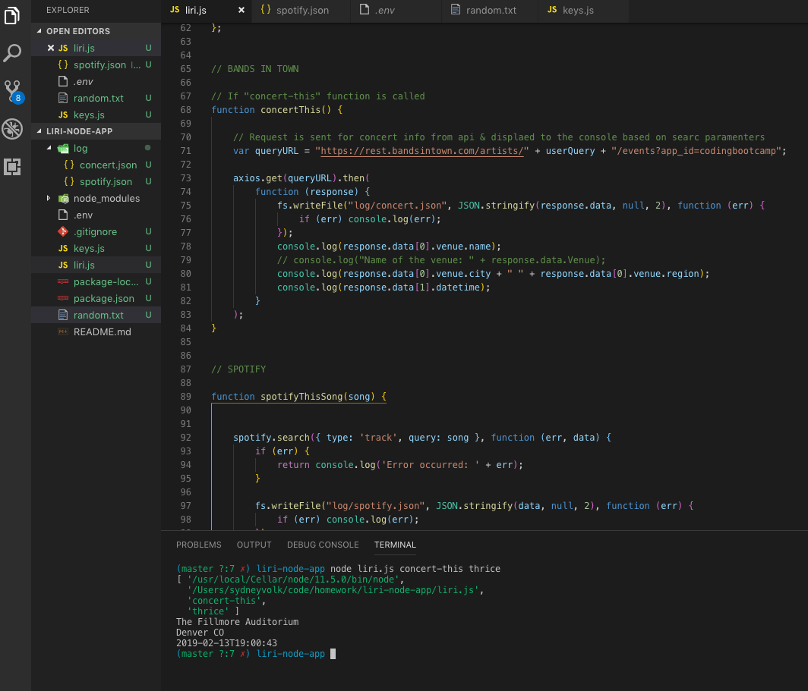
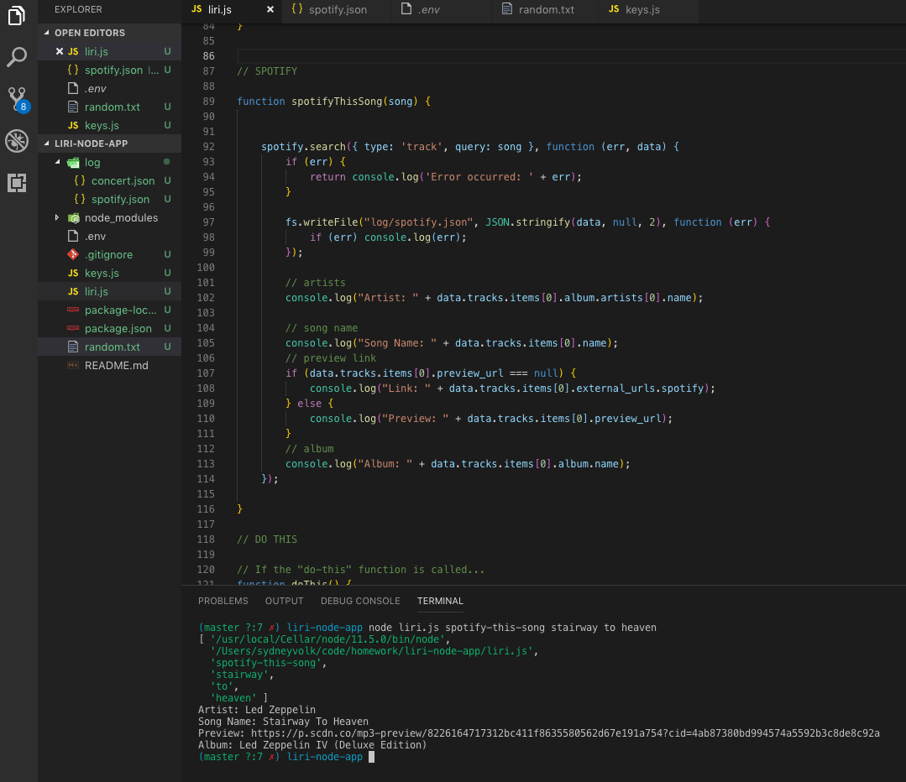
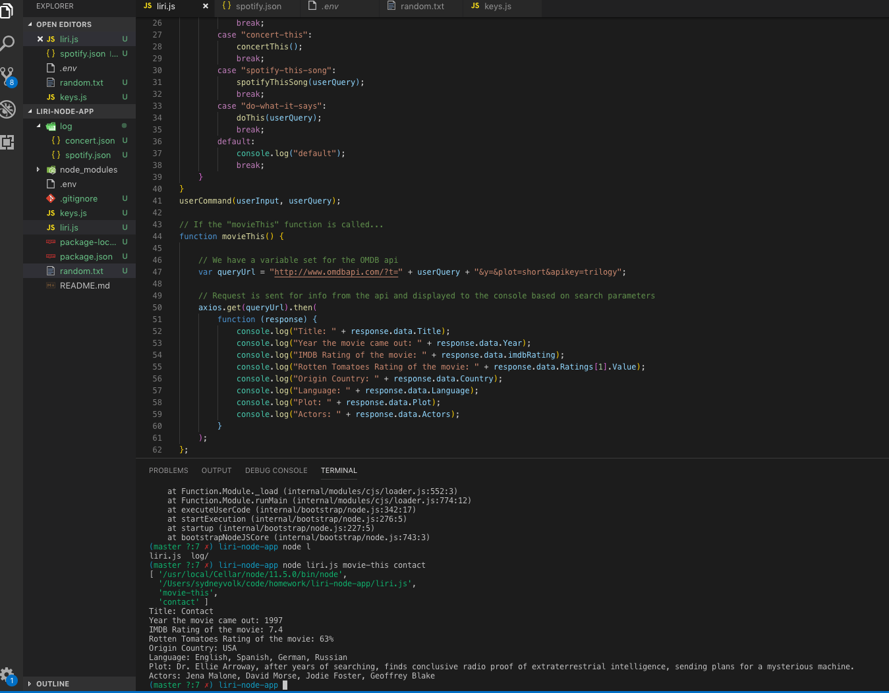
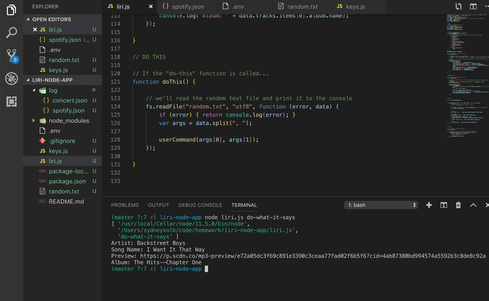

# liri-node-app
About

LIRI is a Language Interpretation and Recognition Interface. LIRI will be a command line node app that takes in parameters and gives you back data.

What it does

CONCERT-THIS

node liri.js concert-this <artist/band name here>

This will search the Bands in Town Artist Events API ("https://rest.bandsintown.com/artists/" + artist + "/events?app_id=codingbootcamp") for an artist and render the following information about each event to the terminal:

Name of the venue

Venue location

Date of the Event

SPOTIFY-THIS-SONG
node liri.js spotify-this-song '<song name here>'
  
This will show the following information about the song in your terminal/bash window

Artist(s)
The song's name

A preview link of the song from Spotify

The album that the song is from

MOVIE-THIS

node liri.js movie-this '<movie name here>'

This will output the following information to your terminal/bash window:

   * Title of the movie.
   * Year the movie came out.
   * IMDB Rating of the movie.
   * Rotten Tomatoes Rating of the movie.
   * Country where the movie was produced.
   * Language of the movie.
   * Plot of the movie.
   * Actors in the movie.
   

If the user doesn't type a movie in, the program will output data for the movie 'Mr. Nobody.'

DO-WHAT-IT-SAYS

node liri.js do-what-it-says

This will output the information we have in the random.txt file, which is connected to the spotify API as well. Terminal should reflect information for "I want it that way" by the Backstreet Boys.

Authors

Sydney Volk
